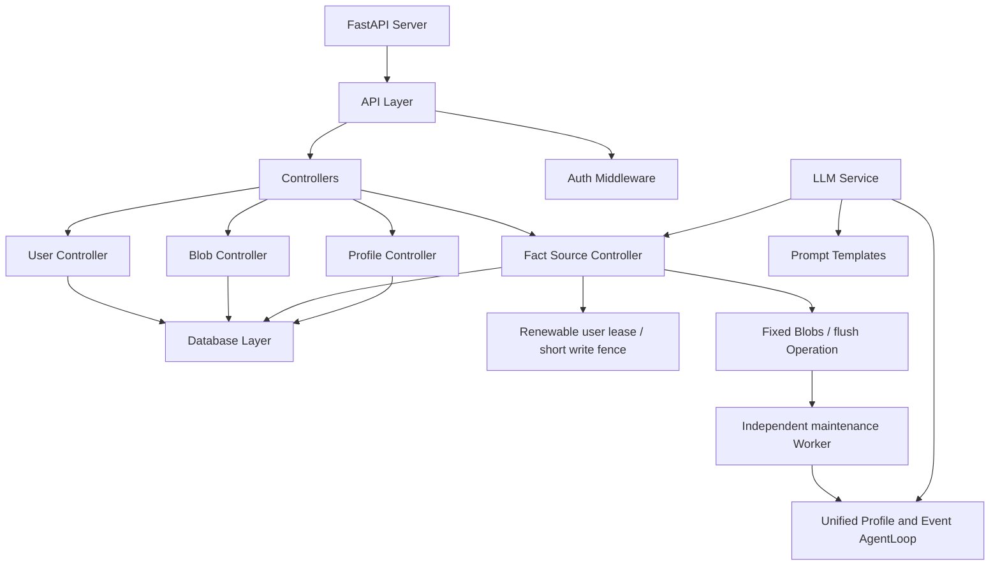
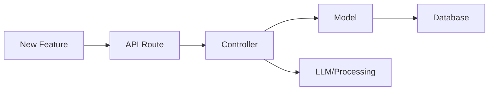

# Memoia Architecture Guide

<!-- Modified for Memoia: corrected package layout and maintenance boundary. -->

Implementation modules below live under `src/server/api/memoia_server/`; the
ASGI entry point is the sibling `src/server/api/api.py`. The only maintained SDK
is `@jianify/memoia` under `sdks/typescript/`; upstream SDKs have been retired.

可靠来源写入、证据撤回、幂等恢复及检索边界以 [API-DESIGN.md](API-DESIGN.md)
为准；协议由 `export-openapi.py openapi.json` 生成，TypeScript SDK 位于
`sdks/typescript/`。只支持唯一 `/api` 和 `@jianify/memoia` SDK；软件版本和历史迁移编号不表示多套运行时协议。
数据库只能经显式 [Alembic 链](migrations/README) 修改；import 不执行 DDL。

## Project Overview

Memoia is a user memory system derived from Memobase. Sources and evidence are the truth; profiles and events are derived memories. This guide describes the module layout; API-DESIGN defines the current processing contracts.

## System Architecture



## Directory Structure

```
memoia_server/
├── api_layer/                # Handlers used by ../api.py
├── models/                   # Data Models
│   ├── database.py          # SQLAlchemy models
│   ├── blob.py              # Data blob definitions
│   ├── response.py          # API response structures
│   └── utils.py             # Utilities and Promise pattern
├── controllers/             # Business Logic
│   ├── user.py             # User management
│   ├── blob.py             # Data blob handling
│   ├── buffer.py           # Legacy buffer operations
│   ├── profile.py          # Direct PostgreSQL profile reads
│   ├── source.py           # Atomic Fact processing and message deletion
│   ├── maintenance.py      # Fixed flush lease and atomic derived commit
│   ├── user_lease.py       # Shared user mutation coordination
│   └── modal/              # Modal processing
├── maintenance_agent.py    # Scoped OpenAI Agents SDK tools and in-memory plans
├── maintenance_worker.py   # Single per-user Profile/Event AgentLoop
├── connectors.py           # Database and Redis connections
├── llms/                   # LLM Integration
│   ├── __init__.py        # LLM service initialization
│   └── openai.py          # OpenAI implementation
└── prompts/               # LLM Prompt Templates
```

## Data Flow

```mermaid
sequenceDiagram
    participant Client
    participant API
    participant Controller
    participant DB
    participant LLM
    participant Redis

    Client->>API: Request
    API->>Controller: Process
    Controller->>DB: Query/Update
    Controller->>Redis: Acquire renewable user lease
    Controller->>DB: Register generation and snapshot; end transaction
    Controller->>LLM: Bounded Fact extraction
    Controller->>DB: CAS Fact/index/receipt/Blob changes commit and raw-input purge
    Controller->>API: Response
    API->>Client: Result
    Note over DB,LLM: Independent Worker seals and claims fixed Blobs
    DB->>LLM: Scoped unified AgentLoop
    LLM->>DB: Atomic Profile/Event and flush receipt commit
```

## Key Components

### 1. Entry Points
- FastAPI Server: `api.py`
- Main Routes: `/api/*`
- Health Check: `/api/healthcheck`
- Worker entry: `python -m memoia_server.maintenance_worker`; startup validates schema, and `--healthcheck` checks its process heartbeat.

### 2. Core Services
- User Management
- Memory Storage
- Profile Processing
- Source imports, retractions and operation recovery

### 3. External Dependencies
- PostgreSQL Database
- Redis renewable user leases and approximate usage counters (not queues or memory caches)
- OpenAI/LLM Service

## Quick Start Routes

### User Flow
1. Create User: `POST /api/users`
2. Get Profile: `GET /api/users/{user_id}/profiles`
3. Permanently forget user: `DELETE /api/users/{user_id}` (strict tombstone receipt).

### Memory Flow
1. Import a bounded source: `POST /api/users/{user_id}/blobs` with source_id/idempotency_key/complete timestamped messages.
2. Inspect the Fact operation with `GET /api/users/{user_id}/operations/by-key/{key}`.
3. `POST /api/users/{user_id}/flush` seals completed Blobs with a stable key; default timed flush is 30s quiet / 120s maximum. Read `/maintenance` and query/retry the original flush Operation.
4. Get Profile: `GET /api/users/{user_id}/profiles`. Old derived text can remain readable while maintenance is pending/failed; invalid Fact evidence cannot.

## Configuration Points

### Environment Setup
```bash
.env
├── DATABASE_URL
├── REDIS_URL
├── PROJECT_ID
└── ACCESS_TOKEN
```

### System Config
```yaml
config.yaml
├── buffer_flush_interval
├── max_chat_blob_buffer_token_size
├── language
└── llm_style
```

默认模型与思考等级为 `best_llm_model: gpt-6-luna`、
`llm_reasoning_effort: high`。项目管理接口保存的 YAML 可以独立覆盖：

```yaml
llm_model: gpt-6-luna
reasoning_effort: high
```

Fact 抽取和后台统一 AgentLoop 均使用该项目配置；工具循环使用 Responses，
不为适配协议静默降低思考等级。项目密钥与可选 Playground 的模型配置仍独立。

## Development Flow



## Common Development Paths

### 1. Adding New Features
1. Define a typed route in `api_layer/`; register it in `api.py` and the export entry.
2. Create controller in `controllers/`
3. Add model in `models/`
4. Update response types

### 2. Modifying Memory Processing
1. Update prompts in `prompts/`
2. Modify Fact extraction in `controllers/source.py`, or scoped derivative tools in `maintenance_agent.py`; tools cannot modify Fact.
3. Verify replay, deletion, per-user serial takeover and partial-stage recovery using isolated PostgreSQL/Redis.

### 3. Database Changes
1. Update models and add a forward Alembic revision; never edit an executed migration.
2. Validate empty installation and non-destructive existing-schema adoption using real PostgreSQL.
3. Update response types and regenerate OpenAPI/SDK contracts when the HTTP protocol changes.
4. Changed schema/embedding identity requires separate maintenance, not ordinary API prepare.

## Testing Routes

### Core Functionality
```bash
# Health Check
curl -X GET http://localhost:8019/api/healthcheck

# Create User
curl -X POST http://localhost:8019/api/users -H "Content-Type: application/json" -d '{"data":{}}'

# Get Profile
curl -X GET http://localhost:8019/api/users/{user_id}/profiles
```

## Common Integration Points

### 1. LLM Integration
- Location: `llms/`
- Config: `env.py`
- Prompts: `prompts/`

### 2. Database Integration
- Models: `models/database.py`
- Connection: `connectors.py`
- Queries: Controllers

### 3. Redis Coordination
- Redis Config: `connectors.py`
- User lease: `controllers/user_lease.py`
- PostgreSQL Operations/Blobs own flush scheduling, receipts and recovery; legacy Buffer cleanup remains in `controllers/buffer.py`.
- Each API/Worker process defaults to 32 Redis connections, 1-second connect and 2-second command timeouts; no implicit command replay. Lease acquisition/release has a 3-second deadline; renewal is bounded by one-third TTL or 3 seconds, whichever is smaller.
- Usage updates use one transaction pipeline for input/output, day/month and TTL. Statistics failure is best-effort, never model replay; reads reject unavailable statistics rather than fabricate zero.
- Token counters include only actual provider usage. Missing usage is logged and counted by `llm_usage_unknown_total`, not estimated or billed. Existing project billing remains independent of user-memory fences; counters are not a financial ledger.
- Profiles always read PostgreSQL. No Redis profile cache or invalidation layer.
